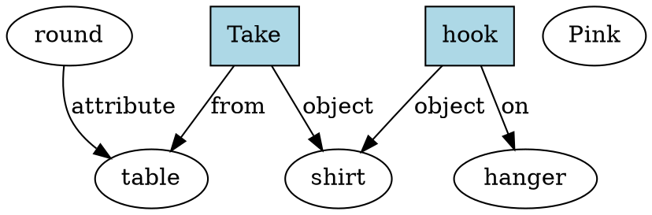

# Robotic-Semantic-Interpretation-of-Voice-Commands-through-Fine-Tuning-GPT2-Small

## 📖 Project Description

This project fine-tunes the `gpt2-small` model to generate semantic Graphviz (DOT) code based on pick-and-place commands for robots. The goal is to translate natural language instructions into structured graph representations.

## 📁 Dataset & Files

- `graphviz_dataset.csv` – 10,000 command–graph pairs generated using GPT-4o.
- `Reduced_Word_Sets.csv` – vocabulary used to create the dataset.
- `test_set_v2.csv` and `test_set_fixed.csv` – two formats of the same test set for evaluation.
- `predictions_cleaned.csv` and `predictions_fine_tuned_gpt2.csv` – expected and generated outputs from the fine-tuned model used for evaluation.

## 📂 Notebook

- **`GPT2_fine_tuning_graphs.ipynb`** – Full workflow with explanations in Markdown cells.

## How to Run
1. Clone this repo
2. Install requirements from `requirements.txt`
3. Run the notebook in Jupyter or VS Code

## Requirements

- Python version: `3.12.7`
- `transformers==4.49.0`
- `torch==2.6.0+cpu`
- `pandas==2.2.2`
- `evaluate==0.4.3`
- `tqdm==4.66.5`
- `pydot==3.0.4`
- `graphviz==0.20.3`

## Example

**Prompt:**
 Command: Take the pink shirt from the round table and hook it on the hanger. 

**Non-Fine-Tuned Output:**
 Command: Take the pink shirt from the round table and hook it on the hanger.

[00:00:00]EMOTE: *no key*/(monkey (912)) : <b>The monkey (912)</b>

**Fine-Tuned Output (Generated Graph):**
Command: Take the pink shirt from the round table and hook it on the hanger.
Graph:

## Author
Sebastian Hec - [@FrotiFratek](https://github.com/FrotiFratek)
